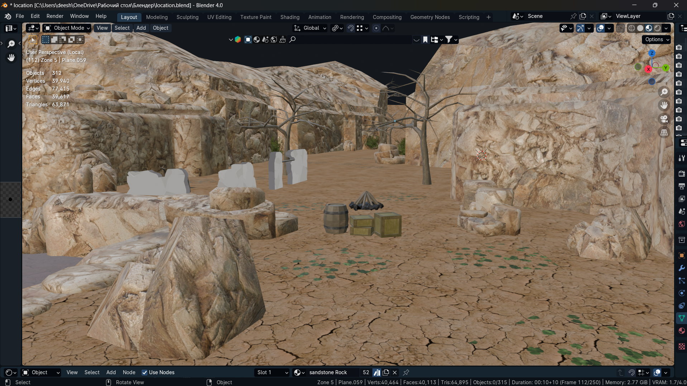
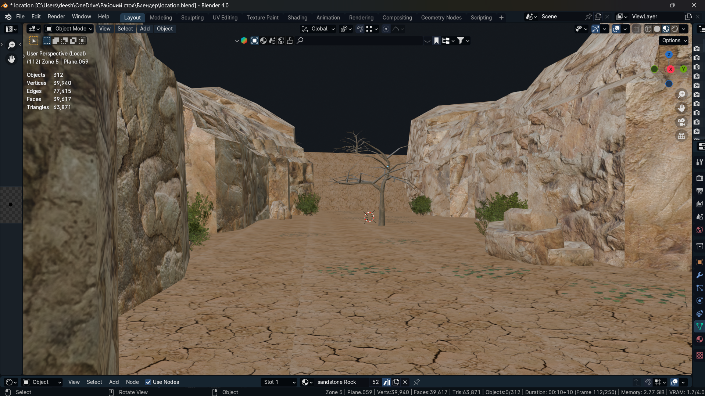
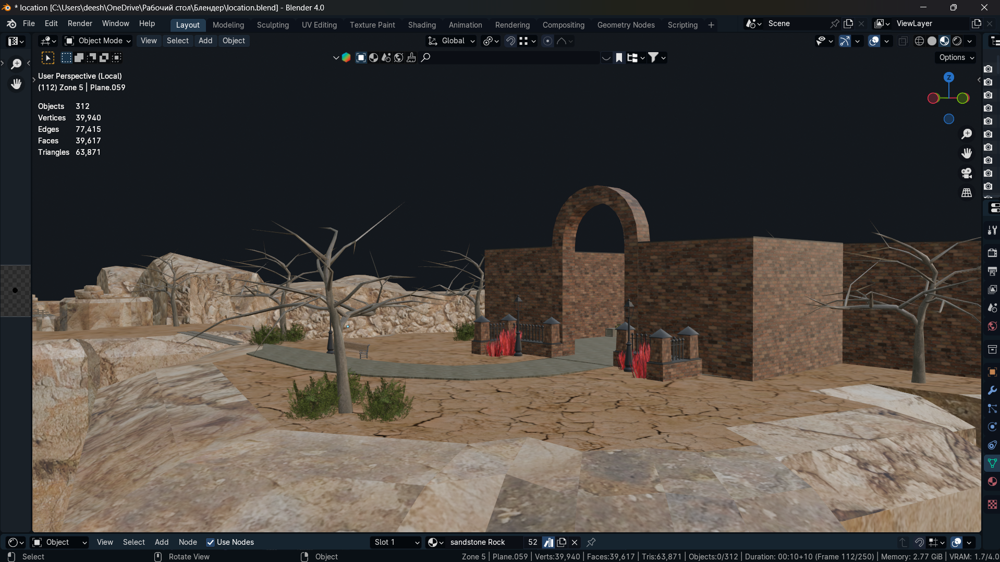
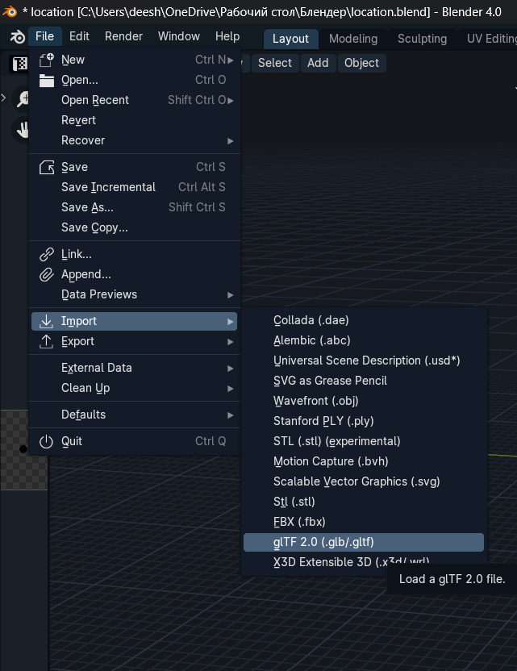
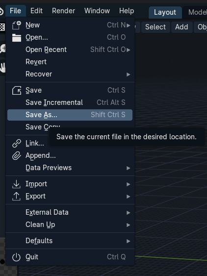
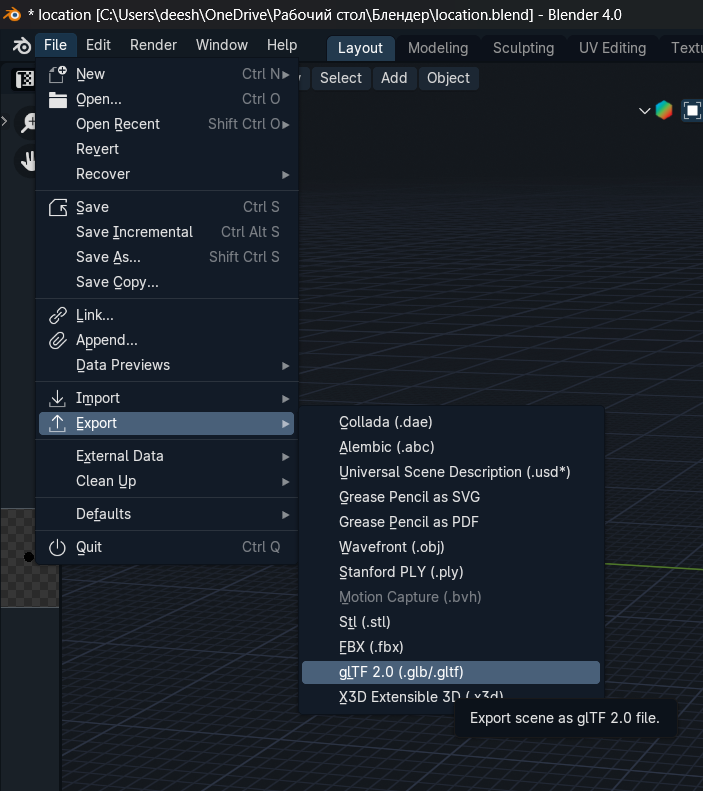
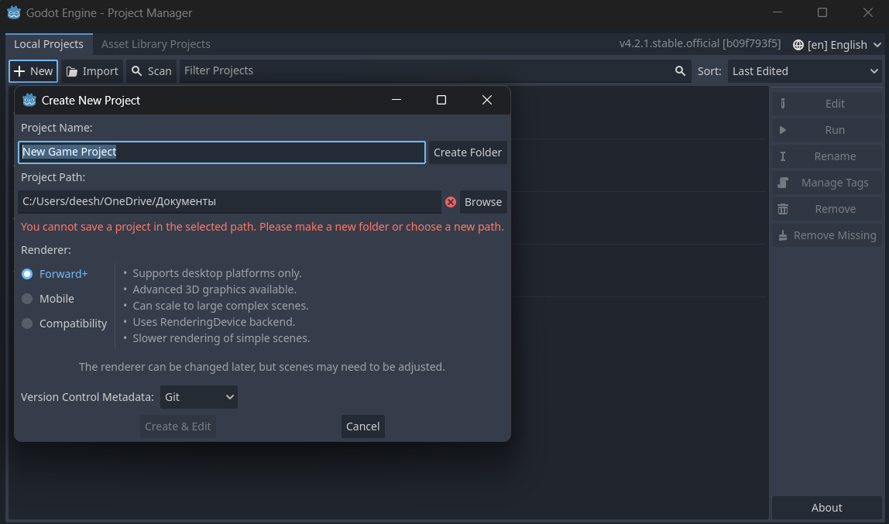
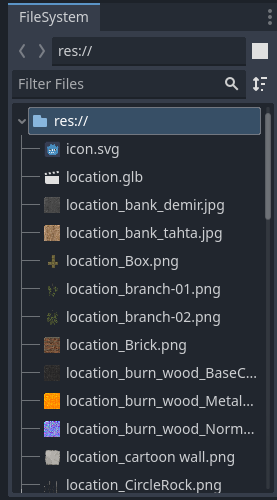

# Локація для гри у Godot
**Ця локація була розроблена з використанням інструменту для 3D-моделювання - Blender. Вона призначена для інтеграції в ігрові проекти, забезпечуючи високу якість графіки та оптимізацію для плавного геймплею.**
___
## Зміст
- [Локація для гри у Godot](#локація-для-гри-у-godot)
  - [Зміст](#зміст)
  - [Автор проекту](#автор-проекту)
  - [Завантажити проект](#завантажити-проект)
  - [Переваги](#переваги)
  - [Зображення локацій](#зображення-локацій)
        - [Перша частина локації](#перша-частина-локації)
        - [Друга частина локації](#друга-частина-локації)
        - [Третя частина локації](#третя-частина-локації)
        - [Четверта частина локації](#четверта-частина-локації)
  - [Користь проекту](#користь-проекту)
  - [Як приступити до роботи](#як-приступити-до-роботи)
      - [У блендері / Blender](#у-блендері--blender)
      - [У годоті / Godot](#у-годоті--godot)
  - [Висновок](#висновок)
___
## Автор проекту
- Панасенко Діана / Panasenko Diana
  - [Github](https://github.com/PanasenkoDiana)

⬆️[Зміст](#зміст) 
___
## Завантажити проект
- https://drive.google.com/drive/folders/1F743H5O7rOnIzi8RymbDf4h58tT1Nm9I?usp=sharing
___
## Переваги
**Цей проект в першу чергу був створений для полегшення розробки ігор, забезпечуючи наступні переваги**:
1. **Висока якість графіки**: Локація створена за допомогою Blender, що забезпечує високу деталізацію та реалістичність.
2. **Оптимізація**: Локація оптимізована для використання в іграх, що дозволяє зменшити навантаження на систему та забезпечити плавний геймплей.
3. **Гнучкість**: Локація легко налаштовується та модифікується під різні типи ігор та жанри.
4. **Інтеграція**: Локація легко інтегрується з ігровим рушієм Godot, що спрощує процес розробки.
5. **Ефективність**: Використання Blender дозволяє швидко створювати та редагувати локації, що підвищує ефективність роботи розробників.

**Ці переваги роблять проект ідеальним вибором для розробників, які хочуть створювати якісні ігри з мінімальними зусиллями.**

⬆️[Зміст](#зміст) 
___
## Зображення локацій
##### Перша частина локації

##### Друга частина локації

##### Третя частина локації

##### Четверта частина локації

⬆️[Зміст](#зміст) 
___
## Користь проекту
**Цей проект мав багато переваг, особливо для мене як новачка у сфері 3D моделювання та розробки ігор:**

1. **Навчання новим навичкам**: Цей проект допоміг мені освоїти основи роботи з Blender, одного з найпопулярніших інструментів для 3D моделювання. Я навчилася створювати об'єкти, текстури, освітлення та анімації, що є важливими навичками для будь-якого розробника ігор.

2. **Творче самовираження**: Проект дозволив мені реалізувати свої творчі ідеї та бачення. Я змогла створити унікальні ігрові локації, які відображали мій стиль та інтереси.
   
3. **Практичний досвід**: Робота над проектом дала мені практичний досвід, який буде корисним при створенні власних ігор або при працевлаштуванні в індустрії відеоігор. Я змогла показати свій проект як приклад своїх навичок та досягнень.
   
4. **Ком'юніті та підтримка**: Blender має велику та активну спільноту користувачів, які завжди готові допомогти та поділитися своїм досвідом. Я знайшла багато навчальних матеріалів, відеоуроків та форумів, де можна було отримати відповіді на свої питання.
   
5. **Розвиток логічного мислення**: Процес створення 3D моделей та ігрових локацій вимагав логічного та креативного підходу до вирішення завдань. Це допомогло мені розвивати аналітичні навички та вміння працювати з комплексними проектами.
   
⬆️[Зміст](#зміст)
___
## Як приступити до роботи
#### У блендері / Blender
1. **Встановлення Blender**:
Якщо у вас ще не встановлений Blender, завантажте його з офіційного сайту blender.org.
Встановіть програму, дотримуючись інструкцій на екрані.
2. **Завантаження проекту**:
Завантажте файл проекту у форматі .glb з наданого джерела (наприклад, з репозиторію або через посилання).
3. **Відкриття проекту в Blender**:
Запустіть Blender.
Перейдіть до меню File (Файл) -> Import (Імпорт) -> glTF 2.0 (.glb/.gltf).
Виберіть завантажений файл проекту у форматі .glb і натисніть Import (Імпорт).

4. **Ознайомлення з проектом**:
Після імпорту проекту, ви побачите всі об'єкти, текстури та налаштування сцени у вікні Blender.
Використовуйте середовище Blender для перегляду та редагування проекту. Ви можете змінювати місця розташування об'єктів, додавати нові елементи, налаштовувати освітлення та текстури.
5. **Редагування проекту**:
Використовуйте інструменти Blender для редагування проекту. Ось кілька основних порад:
Режими редагування: Перемикайтеся між режимами редагування об'єктів (Object Mode) та редагування сітки (Edit Mode) за допомогою клавіші Tab.
Переміщення, обертання та масштабування: Використовуйте клавіші G (переміщення), R (обертання) та S (масштабування) для маніпуляцій з об'єктами.
6. **Збереження змін**:
Після внесення змін до проекту, збережіть його, перейшовши до меню File (Файл) -> Save As (Зберегти як).
Виберіть формат збереження (наприклад, .blend для файлу Blender) і натисніть Save (Зберегти).

7. **Експорт проекту (за потреби)**:
Якщо вам потрібно експортувати проект у формат .glb або інший формат, перейдіть до меню File (Файл) -> Export (Експорт) і виберіть потрібний формат.
Налаштуйте параметри експорту та натисніть Export (Експорт).

⬆️[Зміст](#зміст)
#### У годоті / Godot
1. **Встановлення Godot**:
Якщо у вас ще не встановлений Godot, завантажте його з офіційного сайту godotengine.org.
Встановіть програму, дотримуючись інструкцій на екрані.
2. **Завантаження проекту**:
Завантажте файл проекту у форматі .glb з наданого джерела (наприклад, з репозиторію або через посилання).
3. **Створення нового проекту в Godot**:
Запустіть Godot.
На головному екрані натисніть кнопку New Project (Новий проект).
Введіть назву проекту та виберіть місце для збереження файлів проекту.
Натисніть Create & Edit (Створити та редагувати).

4. **Імпорт проекту у форматі glb**:
Перетягніть завантажений проект у форматі .glb до вікна godot.
Після чого вона з'явиться у переліках файлів у годот. 

Перетягнувши файл location.glb до потрібної сцени, ви зможете приступити до роботи.
1. **Ознайомлення з проектом**:
Після імпорту проекту, ви побачите всі об'єкти, текстури та налаштування сцени у вікні Godot.
Використовуйте середовище Godot для перегляду та редагування проекту. Ви можете змінювати місця розташування об'єктів, додавати нові елементи, налаштовувати освітлення та текстури.
1. **Редагування проекту**:
Використовуйте інструменти Godot для редагування проекту. Ось кілька основних порад:
Режими редагування: Перемикайтеся між різними режимами редагування сцени за допомогою верхньої панелі інструментів. Ви можете редагувати як 2D, так і 3D сцени.
Переміщення, обертання та масштабування: Використовуйте інструменти на верхній панелі або гарячі клавіші W (переміщення), E (обертання) та R (масштабування) для маніпуляцій з об'єктами.
Панелі інструментів: Використовуйте панелі інструментів зліва (інспектор властивостей) та справа (дерево сцени) для доступу до додаткових функцій та налаштувань.
1. **Збереження змін**:
Після внесення змін до проекту, збережіть його, перейшовши до меню Scene (Сцена) -> Save Scene (Зберегти сцену) або натисніть Ctrl + S.
Виберіть місце для збереження файлу сцени та натисніть Save (Зберегти).

⬆️[Зміст](#зміст)
___
## Висновок
**Отже, ця локація для гри у Godot є чудовим прикладом ефективної співпраці між Blender та Godot, що дозволяє створювати високоякісні ігрові сцени, які сприяють розвитку та успіху вашого ігрового проекту.**
